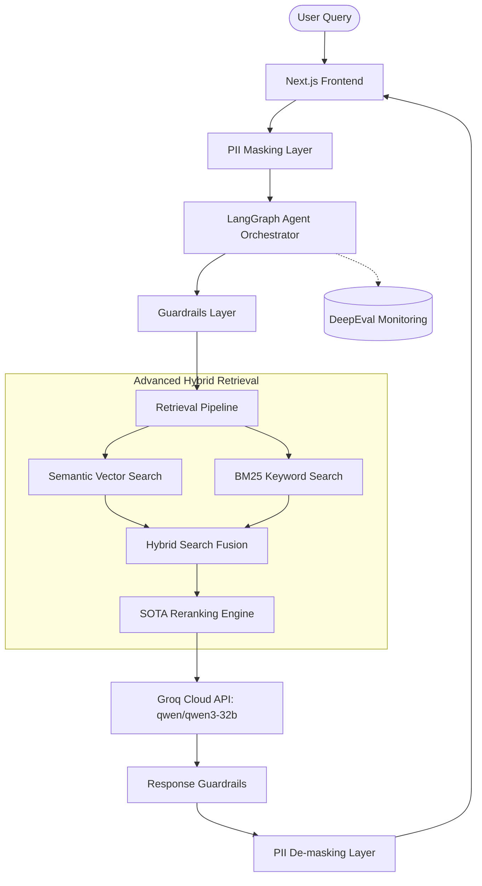

# ⚖️ Barrister Bot Web

Barrister Bot is a state-of-the-art legal assistant designed to provide accurate, context-aware answers to legal queries. This repository houses the front-end user interface, advanced retrieval pipeline, agentic orchestration, and LLM generation logic.

---

## 🚀 Key Features & Architecture



### 1. Agentic Orchestration (`LangGraph`)
We utilize **LangGraph** to build robust, stateful, multi-agent workflows. This allows Barrister Bot to:
- Dynamically decide when to retrieve documents versus when to ask follow-up questions.
- Perform multi-hop reasoning over complex legal scenarios.
- Correct and self-heal retrieval results before generation.

### 2. Hybrid Retrieval Pipeline (`Vector Search` + `BM25` + `Reranking`)
To ensure high recall and precision on domain-specific legal terminology, we implement a hybrid search strategy:
- **Semantic Search**: Captures conceptual meaning and contextual synonyms using dense vector embeddings.
- **BM25 Search**: Captures exact legal citations, case numbers, statutory sections, and names.
- **State-of-the-Art Reranking**: Cross-encodes the fused search results to prioritize the most relevant passages for the LLM context window.

### 3. High-Performance Generation (`Groq Cloud`)
- Powered by the blazing-fast inference of **Groq Cloud**.
- Utilizes the **`qwen/qwen3-32b`** model to process complex legal documents and synthesize coherent, accurate arguments.

### 4. Privacy, Safety & Alignment (`PII Masking & Guardrails`)
Legal assistants must be secure, private, and compliant with privacy standards. We integrate:
- **PII Masking**: Redacts sensitive personal information (such as names, personal IDs/CNICs, phone numbers, and addresses) from the user query before sending data to external APIs, and re-injects/de-masks them before displaying the final response.
- **Guardrails**: Prevents hallucinated citations, blocks prompt-injection attempts, and ensures the model does not provide unauthorized legal advice (acting strictly as an educational/research tool).

### 5. Continuous Quality & Evaluation (`DeepEval`)
We use **DeepEval** to run regression tests and monitor production quality across key legal metrics:
- Faithfulness (Factual Consistency)
- Answer Relevancy
- Context Recall
- Hallucination detection

---

## 📁 Repository Structure

```
├── app/                  # Next.js App Router (UI & API Routes)
├── components/           # Reusable UI Components
├── lib/
│   ├── agents/           # LangGraph workflows and state definitions
│   ├── guardrails/       # Input/Output validation layers
│   ├── retrieval/        # Hybrid search & reranking logic
│   └── utils/            # Shared helper functions
├── tests/
│   └── evaluation/       # DeepEval testing suites
├── .env.example          # Template for environment variables
└── README.md             # This file
```

---

## 🛠️ Getting Started

### Prerequisites
- Node.js (v18.x or higher)
- Access to a Vector Database (e.g., Weaviate, Pinecone, or pgvector)
- A Groq Cloud API Key

### Installation

1. **Clone the repository:**
   ```bash
   git clone https://github.com/your-username/barrister-bot-web.git
   cd barrister-bot-web
   ```

2. **Install dependencies:**
   ```bash
   npm install
   ```

3. **Set up Environment Variables:**
   Create a `.env.local` file by copying the template:
   ```bash
   cp .env.example .env.local
   ```
   Provide the required values:
   ```env
   # LLM & API Keys
   GROQ_API_KEY=your_groq_api_key
   LLM_MODEL=qwen/qwen3-32b

   # Vector Database Config
   VECTOR_DB_URL=your_vector_db_url
   VECTOR_DB_API_KEY=your_vector_db_key
   
   # DeepEval Config
   DEEPEVAL_TELEMETRY=true
   ```

4. **Run the Development Server:**
   ```bash
   npm run dev
   ```
   Open [http://localhost:3000](http://localhost:3000) with your browser to see the application.

---

## 🧪 Running Evaluations
To validate the retrieval and generation pipeline using DeepEval:
```bash
npm run test:eval
```
*(or run the Python evaluation script if configured in your environment)*

---

## 🛡️ License
This project is licensed under the MIT License.
